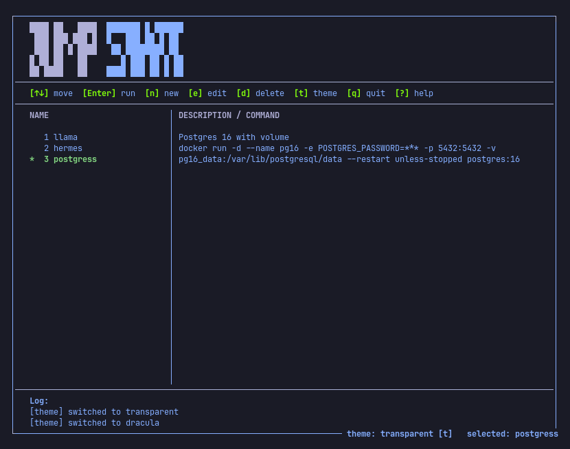

# Jumpstart TUI

A lazydocker-style terminal UI for saving and launching shell commands —
`docker run` one-liners, build jobs, service scripts. Commands are stored as
plain entries (name, description, raw shell command) and launched **detached**:
the TUI never blocks, and you follow the process in docker/lazydocker or by
tailing its log.

Built with the same TUI architecture as
[nvidia-tui-overclocker](https://github.com/alystor007/Nvidia-TUI-overclocker):
flicker-free diff rendering, 8 switchable themes, session action log.

## Screenshot



## Files

| File | Purpose |
|------|---------|
| `jumpstart_tui.py` | The TUI (run this). |
| `run_command.py` | Standalone launcher — the TUI calls it; also usable from the shell. |

## Requirements

- Linux with a terminal supporting 256 colors (8 colors works, falls back to the dark palette)
- Python 3.10+, curses (standard library — **zero third-party dependencies**)

## Usage

Run the TUI:

```
python3 jumpstart_tui.py
```

Standalone launcher:

```
python3 run_command.py --list       # list saved commands ('*' = selected)
python3 run_command.py <name>       # start a saved command detached
```

## Keys

| Key | Action |
|-----|--------|
| `Enter` | Run the selected command (detached) |
| `x` | Open the Commands menu |
| `↑` / `↓` | Move the cursor (menu open) |
| `Enter` | Select the cursor command and close the menu |
| `n` | Define + save a new command (name, description, shell command) |
| `d` | Delete the cursor command (menu open) |
| `t` | Cycle color theme |
| `?` | Help overlay |
| `q` / `Esc` | Quit (Esc also closes the menu/help) |

`Esc` + `Enter` cancels a prompt.

## Data

One source of truth, created on first save:

```
~/.config/jumpstart/commands.json
```

```json
{
  "selected": "postgres",
  "postgres": {
    "desc": "Postgres 16 with volume",
    "cmd": "docker run -d --name pg16 -e POSTGRES_PASSWORD=*** -p 5432:5432 -v pg16_data:/var/lib/postgresql/data --restart unless-stopped postgres:16"
  }
}
```

The command is executed via `bash -c`, so pipes, `&&`, env vars and quoting all
work. Commands run in the directory the TUI was launched from (a per-command
`cwd` field is a candidate for a later version).

- Theme persists to `~/.config/jumpstart/theme`.
- Command output goes to `~/.local/state/jumpstart/logs/<name>-<timestamp>.log`.
- First run starts empty on purpose: there is no seeded command you could
  accidentally fire.

## Execution model

Pressing `Enter` calls `run_command.py <name>`, which spawns the command in
its own session (`start_new_session`, `stdin=/dev/null`, stdout+stderr → log)
and exits immediately. The TUI records the pid + log path in its session log
and is never blocked. To stop a detached process, manage it in the tool that
owns it (e.g. `docker stop <name>`) or `kill <pid>` from the TUI log line.

## Development

- Lint: `ruff check .` (config: `ruff.toml`, line-length 160, F/E rules)
- CI (`.github/workflows/ci.yml`): byte-compile + ruff on push/PR
- License: GPL-3.0-or-later
